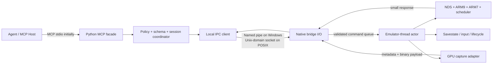

# melonDS-MCP 架构

状态：历史 GDB/IPC 设计参考，**不代表当前默认实现**。

2026-09-04：开发主线已改为 `mcp/` 的 `MCP stdio → Python/ctypes → shared core`。
构建、实测范围及限制见 [当前使用说明](../../mcp/README.md)；待办见 [路线图](ROADMAP.md)。
下文保留用于未来 GUI attach/进程隔离设计，不作为当前无头版本的前置门槛。

基线日期：2026-09-01

上游项目：<https://github.com/melonDS-emu/melonDS>

固定上游提交：`906e9ebb27da8c6a715cd7abab4abfe8a8d29427`

## 1. 目标与原则

melonDS-MCP 的目标是把正在运行的 Nintendo DS/DSi 模拟器变成可被 Agent 安全、即时、可复现地观察和控制的本地系统。最终能力包括：

- 启动、装载 ROM、重置、暂停、继续、逐帧和输入注入；
- ARM9/ARM7 寄存器、内存、断点、单步和执行状态调试；
- 无副作用内存查看、受控内存修改、搜索、差分和追踪；
- ARM/Thumb 反汇编、符号关联，以及与外部静态分析器协作的真正反编译；
- 双屏截图、VRAM、调色板、OAM、2D 图层、3D 纹理和 GPU 状态查看；
- savestate、确定性回放、证据快照和可审计的 Agent 工作流。

设计遵守以下原则：

1. **MCP 与模拟器故障域分离。** Python MCP facade 是独立进程，melonDS 崩溃不会破坏 MCP 宿主，MCP 客户端断开也不应终止模拟器。
2. **模拟器线程拥有模拟状态。** 网络或 IPC 线程不得直接读取或修改 `NDS`、CPU、GPU 等对象；它们只能投递命令，由模拟器线程在安全点执行。
3. **一致性是显式协议。** 工具不会为了方便而隐式暂停。需要暂停状态的调用必须看到并携带正确的 `stop_id`/`state_version`。
4. **观察默认无副作用。** 普通内存读取不能误触 MMIO FIFO、清除中断标志或推进设备状态；“总线读取”和“调试 peek”是两类不同操作。
5. **所有大数据有界。** 内存、追踪和图像均采用分页、上限和二进制旁路，避免把无限数据塞入 MCP JSON。
6. **先建立窄而真实的纵切，再逐步替换。** 当前 GDB-RSP 后端用于验证 Agent 工具形状和并发约束，但不是最终控制平面。

本项目继承上游 GPL-3.0 许可边界；发布二进制时必须同时满足上游及新增代码的许可证义务。

## 2. 当前纵切：独立 MCP facade + GDB-RSP

当前数据路径如下：

```text
MCP Host / Agent
       │ MCP stdio（stdout 仅协议帧）
       ▼
Python MCP facade
  ├─ MCP 工具与参数校验
  ├─ 会话锁、state_version、stop_id
  ├─ ARM/Thumb Capstone 反汇编
  └─ 双端口 GDB-RSP 会话管理
       │ TCP loopback，ARM9:3333 / ARM7:3334
       ▼
melonDS upstream GdbStub
       │ 在模拟器线程上轮询和执行
       ▼
ARM9 / ARM7 / NDS memory bus
```

实现位于 `mcp-server/`。MCP server 使用本地 stdio，不监听网络端口；日志只能写入 stderr。RSP 客户端默认只允许回环地址，除非运行者显式启用远程目标。当前已具备：

- attach/detach、状态查询、显式选择 active core、继续；
- CPU 寄存器读取和修改、单步；
- 有界安全内存区域读写及写后校验/失败回滚；
- 执行断点；
- Capstone ARM/Thumb 结构化反汇编；
- MCP 工具契约和伪 RSP 端到端测试。

### 2.1 为什么一次只能停一个 CPU

上游 ARM9 和 ARM7 GDB stub 都由同一个模拟器线程轮询。一个 CPU 进入 GDB `Enter()` 停止循环后，同一线程不能再服务另一个 CPU 的 socket。因此：

- attach 两个端口时，facade 必须连接一个、立即 `continue`，再连接另一个；
- 切换 active core 时，必须先恢复当前 stopped core，再中断目标 core；
- 任意时刻最多有一个可操作的 active stopped core；
- 当前 `consistency=active_core_gdb_stop` **不等于** ARM9、ARM7、DMA、GPU 和设备的全局一致快照。

这是过渡后端的根本限制，而不是最终 API 应保留的语义。

### 2.2 GDB-RSP 后端的安全边界

| 项目 | 当前保证 | 限制 |
| --- | --- | --- |
| 执行模式 | 解释器/GDB 路径可调试 | JIT 与当前上游 GDB 调试路径不能同时可靠使用，必须关闭 JIT |
| 双 CPU | facade 避免双 stub 死锁 | 无 stop-the-world；不能产生双 CPU 同时刻快照 |
| 内存传输 | 单次 MCP 请求有上限；RSP 内部分块 | 通过 CPU 总线 API 读取，无法普遍保证无副作用 |
| MMIO 读取 | `0x04000000..0x04ffffff` 硬拒绝 | 没有调试专用 peek API；不存在 opt-in |
| MMIO 写入 | `0x04000000..0x04ffffff` 硬拒绝 | 过渡后端不会把设备访问包装成伪事务 |
| MMIO 反汇编 | 硬拒绝 | `disassemble` 在取指前复用安全内存区域策略 |
| 普通内存写入 | 先读 before-image，写入、验证，失败时回滚 | 设备映射或并发硬件改变的区域不能视为严格原子 |
| 执行断点 | 上游 `Z0/z0` 路径 | 受解释器/GDB 执行路径约束 |
| watchpoint | MCP 工具不暴露 | 上游存在 `CheckWatchpt` API，但 CPU/总线访问路径没有完整调用点，不能宣称可用 |
| CPSR 写入 | facade 明确拒绝 | 上游 RSP 直接赋值可能绕过安全的 bank/mode 切换；等待原生安全包装 |
| 图形 | 无 | RSP 不提供 renderer-neutral framebuffer/GPU inspection |

过渡后端用于早期开发、契约验证和回归测试。任何需要一致双核状态、MMIO 精确语义、图形或完整工作流控制的功能，都必须走原生桥接。

## 3. 最终架构



### 3.1 Python MCP facade

facade 保持为独立 Python 包，负责：

- MCP 工具、资源和错误模型；
- JSON schema、地址/长度/枚举校验和输出大小限制；
- 会话身份、并发请求排序、超时和取消；
- `expected_stop_id`/`expected_state_version` 前置条件；
- 权限策略（只读、调试写入、生命周期和文件访问分级）；
- Capstone 等非模拟器内分析；
- 将大块内存和图像转换为 MCP 内容或受限本地 artifact。

facade 不应解析或依赖 Qt UI 对象，也不应把 melonDS 日志混入 MCP stdout。

### 3.2 本地 IPC

原生桥接使用进程本地 IPC：Windows named pipe，POSIX Unix-domain socket。协议采用固定 32-byte little-endian `MDSB` header，随后是定长 UTF-8 JSON object 和可选原始二进制 payload，详细格式见 [PROTOCOL.md](PROTOCOL.md)。默认安全策略为：

- 仅本机端点；
- 操作系统用户 ACL；
- 每次 melonDS 启动生成不可预测的 session token；
- 不在命令行、日志或 MCP 响应中回显 token；
- 请求、header 和二进制长度均有硬上限；
- 不加载远程 URL，不接受任意主机文件路径。

IPC I/O 线程只做 framing、认证、基本 schema 检查和队列投递。它不得直接解引用模拟器对象。

### 3.3 Emulator-thread actor

native bridge 在模拟器线程上提供 actor/command queue。Qt 前端已有的 `EmuThread` 消息模式可作为集成参考，但核心调试接口应位于不依赖 Qt 的层，供 GUI 和未来 headless host 共用。

命令在明确的安全点执行：

- frame 边界；
- scheduler 已停止且 ARM9/ARM7 均不在执行指令的全局暂停屏障；
- renderer 已完成当前帧且可安全复制资源的 capture 屏障；
- reset/load/save 等生命周期事务边界。

actor 必须按提交顺序执行同一 session 的命令，并为每个响应附带执行后的快照版本。取消只能取消尚未开始的命令；已经开始的状态修改必须完成并返回确定结果，不能在中途留下未知状态。

### 3.4 原生 Debug Coordinator

Debug Coordinator 是最终一致性中心，职责包括：

- 全局 pause/resume，停止 ARM9、ARM7、scheduler 和相关设备推进；
- 在一个 barrier 内读取两个 CPU 的寄存器和所需内存；
- interpreter 指令边界的 step、breakpoint 和 watchpoint；
- 维护 `session_id`、`state_version`、`stop_id`、`frame_number`；
- 区分 debug peek、CPU bus read 和 CPU bus write；
- 对修改执行前置条件检查和清晰的失败语义；
- 统一报告停止原因、CPU、PC、断点/观察点和异常信息。

原生实现可以复用 `NDS::RunFrame`、ARM 调试入口、`ARM9Read*`/`ARM7Read*` 和 write API，但不能简单地从 IPC 线程调用它们。现有总线 API 对 MMIO 可能有副作用，必须新增或抽取调试专用 peek 映射。

## 4. 一致性与版本模型

最终响应的最小快照为：

```json
{
  "session_id": "opaque-random-id",
  "run_state": "stopped",
  "state_version": "184",
  "stop_id": "12",
  "frame_number": "9831",
  "consistency": "global_stop_the_world"
}
```

计数器以十进制字符串跨进程传输，避免不同 JSON 实现的整数精度差异。

- `session_id`：每次模拟器实例/桥接重启后变化。旧 session 的任何 mutation 都必须失败。
- `state_version`：Agent 可见状态每次发生变更时单调递增，包括执行、输入、内存/寄存器修改、reset/load-state 和新 stop。读取不递增。
- `stop_id`：每次进入一个新的全局 stopped generation 时递增。连续读取同一 stop 不变；step 后再次停止会得到新值。
- `frame_number`：在当前运行世代内完成的帧数。reset/load-state 后是否重置必须由响应中的 lifecycle generation 明确，不可仅凭它判断新旧。

规则：

1. 工具不得隐式从 running 切到 stopped；Agent 先显式 pause，再读取状态。
2. 所有只在 stopped 状态合法的 mutation 必须带 `expected_stop_id`，并在 actor 执行瞬间比较。
3. 非 stop 绑定的竞争修改必须带 `expected_state_version`。
4. mismatch 返回 `STALE_STOP` 或 `STALE_STATE`，不得“尽力执行”。
5. 一次 global snapshot 的 ARM9、ARM7、内存和设备摘要必须来自同一 barrier 和同一 `state_version`。
6. 长读取应返回 capture version；如果无法在一个 barrier 内完成，则分页 token 固定其 backing snapshot，而不是边跑边读。

当前 RSP 后端只有 `state_version`、`stop_id` 和 `active_core_gdb_stop`，没有 `session_id`、`frame_number` 或全局 barrier；调用者必须根据 `backend` 和 `consistency` 判断保证等级。

## 5. 内存访问模型

最终 API 将内存访问明确分成三种语义：

| 语义 | 用途 | 副作用 | 默认权限 |
| --- | --- | --- | --- |
| `debug_peek` | RAM/ROM/VRAM/寄存器观察、Agent 推理 | 必须无副作用 | 只读工具默认采用 |
| `debug_poke` | 在 stopped barrier 内修改存储 | 不模拟 CPU 总线事务；需 cache/JIT invalidation | 需 mutation 权限和版本前置条件 |
| `bus_access` | 精确模拟 CPU 对 MMIO/总线的读写 | 明确可能清 FIFO、ack IRQ、触发 DMA 等 | 默认禁用；显式 dangerous 工具 |

debug peek 不应通过普通 `NDS::ARM9Read*`/`ARM7Read*` 对所有地址盲读。native bridge 需要维护按核心和模式区分的区域描述表，并为以下区域提供可验证映射：BIOS/TCM、main RAM、WRAM、VRAM bank、palette、OAM、cart/ROM，以及只读的设备寄存器快照。未知区域返回 `UNSAFE_ADDRESS_SPACE`。

写入事务至少要返回：请求范围、实际修改范围、before/after hash、是否验证、是否完成 cache/JIT invalidation，以及失败时是否完整回滚。MMIO `bus_access` 永远不能宣称可回滚或原子。

## 6. 图形检查

上游 `GPU::GetFramebuffers` 是屏幕捕获的起点，但两个 renderer 的返回语义不同：software renderer 可提供 256×192、32-bit BGRA RAM buffer；OpenGL renderer 可能返回 renderer-owned handle/state。原生 capture adapter 必须：

- 在 render/capture barrier 取得同一帧的上下屏；
- 复制而非跨线程借用 renderer-owned buffer；
- 统一转换为带 stride、色彩格式、screen、frame_number 的 RGBA8 或 PNG；
- 同时保留原始像素/metadata 接口，便于视觉差分；
- 在 software 和 OpenGL renderer 上产生等价、可测试的语义。

后续 GPU inspection 不等同于截图。VRAM bank、palette、OAM、tile/map、2D layer、3D command/texture 应作为结构化资源逐步实现，每项都附带 capture `state_version` 和 `frame_number`。

## 7. 反汇编与真正反编译

这两个能力必须严格区分：

- **反汇编（已具备基础纵切）**：从 emulated memory 读取 ARM/Thumb 字节，用 Capstone 输出地址、机器码、mnemonic 和 operands。后续加入符号、跳转目标、函数边界和代码/数据标记。
- **反编译（尚未实现）**：生成控制流图和高级伪代码。计划通过可选的 Ghidra headless/static-analysis adapter 实现，以 ROM/模块快照、装载地址和运行时符号为输入。其输出必须标明分析器版本、输入 hash 和推断性质。

任何 Capstone 输出都不得标注为“伪 C”或“反编译结果”。动态执行追踪、寄存器值和内存样本可以作为外部反编译器的证据，但不会自动使结果成为精确源代码。

## 8. 能力演进

| 能力 | 当前 RSP 纵切 | 原生桥接目标 |
| --- | --- | --- |
| MCP stdio facade | 已实现 | 保留 |
| ARM9/ARM7 attach | 已实现，双 GDB 端口 | 单一 authenticated local IPC session |
| pause 一致性 | 单 active core | ARM9+ARM7+devices stop-the-world |
| registers / step | 已实现基础能力 | 安全 bank/mode 语义、统一 stop reason |
| memory | 总线访问，MMIO 受限 | debug peek/poke 与 dangerous bus access 分离 |
| breakpoint | 执行断点 | 条件断点、命中计数、两核协调 |
| watchpoint | 不可用 | 在 interpreter/memory path 实际挂钩并测试 |
| disassembly | Capstone ARM/Thumb | 符号、CFG、trace 关联 |
| decompilation | 无 | 可选 Ghidra adapter |
| lifecycle/input/savestate | 无 | 原生 actor 命令 |
| screenshots/GPU | 无 | renderer-neutral capture 和结构化 GPU inspection |
| JIT | 调试时关闭 | 明确 debug mode；修改后安全 invalidation |
| headless | 无专用 host | 共享核心 bridge，可由 GUI 或 headless host 承载 |

具体里程碑和验收门槛见 [ROADMAP.md](ROADMAP.md)。

## 9. 不变量

后续实现和 code review 应持续检查这些不变量：

- MCP stdout 永远没有日志、进度文本或原生进程输出；
- IPC/网络线程永远不直接访问活跃的模拟状态；
- `read_only` 工具不会推进模拟时钟，也不会触发设备副作用；
- 不满足版本前置条件的 mutation 不执行任何部分写入；
- 每个结果都声明 backend 和 consistency 等级；
- 大数据读取有长度上限、分页或二进制旁路；
- 文件系统操作只使用用户显式授权的 ROM、savestate 和 artifact 路径；
- watchpoint 在访问路径真正覆盖并通过测试前不对 MCP 暴露；
- screenshot 在 software/OpenGL 上未通过像素/帧一致性测试前不标记稳定；
- “disassembly”和“decompilation”在工具名、schema 和文档中始终分开。
